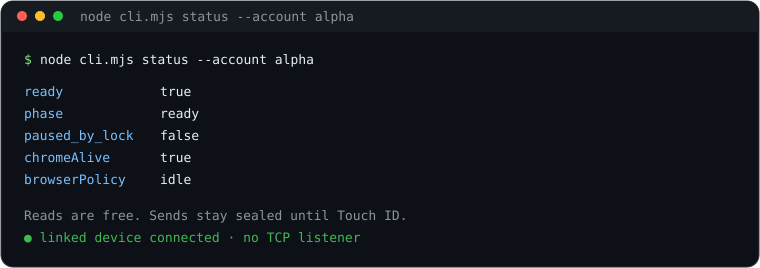
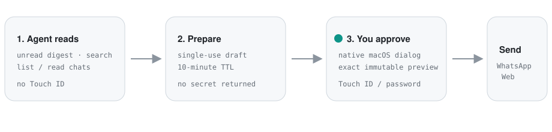

<p align="center">
  
</p>

<h1 align="center">whatseal</h1>

<p align="center">
  <strong>Sealed WhatsApp MCP.</strong> Local linked-device session for AI agents.<br>
  Reads are free. Every send, quote-reply, reaction, or mark-read waits for Touch ID.
</p>

<p align="center">
  
  
  
  
  
</p>

<p align="center">
  <a href="#quick-start">Quick start</a> ·
  <a href="#how-it-works">How it works</a> ·
  <a href="#mcp-setup">MCP setup</a> ·
  <a href="#agent-tools">Tools</a> ·
  <a href="#security">Security</a> ·
  <a href="#operations">Ops</a>
</p>

<p align="center">
  
</p>

An unofficial WhatsApp Web linked device, isolated in headless Chrome, spoken to over MCP stdio. The agent can read your inbox. It cannot send a single character until a native macOS dialog shows the **exact immutable preview** and you approve it with Touch ID or your login password.

This is not the WhatsApp Business Platform. WhatsApp can change the web client or the rules at any time.

---

## Why this exists

Most WhatsApp-for-agents setups give the model a live send button. That is a bad idea on a machine that also holds a personal inbox.

whatseal splits the job:

| The agent may | The agent may not |
| --- | --- |
| List chats, search, read, digest unread | Send, quote-reply, react, or mark-read without you |
| Prepare a draft and show you the preview | Derive an approval secret from tool output |
| Diagnose pairing, idle-cold, or lock-pause | Keep Chrome hot in a closed laptop bag |

Default posture: **bag-safe** (Chrome dies on lock / lid close) and **idle** (Chrome closes after 15 minutes without WhatsApp RPC). The Unix control socket stays up. No `caffeinate`. No prevent-sleep.

<p align="center">
  
</p>

---

## Quick start

Requires **macOS**, **Node.js 22+**, and **Google Chrome**. Touch ID is the send gate. Windows Hello / Linux polkit adapters are **not** a finished product — sealed send is fail-closed there (a local emulator is planned, not shipped).

```bash
npm install -g whatseal    # or: npx whatseal setup
whatseal setup
whatseal qr                # scan from the phone
# Phone: WhatsApp → Settings → Linked Devices → Link a Device
whatseal wait-ready
```

`setup` copies `accounts.example.json` → `~/.local/state/whatsapp-agent/accounts.json` only if missing (a checkout `accounts.json` still wins when present). It also installs the `/whatseal` skill and prints MCP snippets. It does **not** register a LaunchAgent unless you pass `--install-agent`. Override with `WHATSEAL_ACCOUNTS`.

Point your agent at stdio:

```json
{
  "mcpServers": {
    "whatseal": {
      "command": "npx",
      "args": ["-y", "whatseal", "mcp"]
    }
  }
}
```

Hermes:

```bash
printf 'Y\n' | hermes mcp add whatseal --command npx --args -y --args whatseal --args mcp
hermes mcp list
```

### From source

```bash
git clone https://github.com/edosulai/whatseal-mcp.git
cd whatseal-mcp
cp accounts.example.json accounts.json   # gitignored; local aliases only
node cli.mjs setup
# optional persistent backend (asks first):
./install-launchagent.sh install --account alpha
```

From a checkout, `mcp-wrapper.sh` still works as a thin exec of `bin/whatseal-mcp.mjs`. Manual skill install: `node cli.mjs install-skill` / `whatseal install-skill`.

---

## How it works

```
  AI agent  ──stdio──►  mcp-server.mjs  ──unix socket 0600──►  daemon.mjs
                                                                   │
                                                            headless Chrome
                                                            LocalAuth profile
                                                                   │
                                                            WhatsApp Web
                                                                   ▲
  native-approval.swift  (Touch ID / password, immutable preview) ─┘
```

| File | Purpose |
| --- | --- |
| `daemon.mjs` | Headless Chrome + WhatsApp client + private control socket |
| `mcp-server.mjs` | Agent tools over MCP stdio |
| `cli.mjs` | Local diagnostics; `install-skill` copies the agent skill |
| `mcp-wrapper.sh` | Self-bootstrapping MCP entry (`npm ci --ignore-scripts`) |
| `install-launchagent.sh` | Idempotent macOS LaunchAgent lifecycle |
| `native-approval.swift` | Immutable native preview + LocalAuthentication |
| `native-lock-state.swift` | Lightweight CGSession screen-lock probe |
| `lib/lock-power-guard.mjs` | Bag-safe lock / clamshell policy (default ON) |
| `lib/browser-lifecycle.mjs` | Idle / on-demand / always browser policy |
| `lib/http-policy.mjs` | Default-off local HTTP + approval-safe Web send adapter |
| `lib/platform.mjs` | Path / socket / fail-closed Win·Linux adapters |
| `skills/whatseal/` | Bundled `/whatseal` skill + references |
| `tests/` | Non-networked safety and serialization tests |

Deeper threat model: [`RISK-CONTROLS.md`](./RISK-CONTROLS.md). Tested runtime tuples: [`KNOWN-GOOD.md`](./KNOWN-GOOD.md).

The MCP process only speaks stdio. It does **not** auto-start Chrome. Stopped or unpaired tools return structured guidance (`code`, `userMessage`, `agentNextSteps`, exact shell commands) instead of failing opaquely.

`idle_cold` is not stopped. The control socket is up; the next WhatsApp read wakes Chrome (up to ~3 minutes). Use `whatsapp_wait_ready` (`timeoutSec=180`) or `whatseal wait-ready` — do not start extra accounts or scan a new QR.

### Agent workflow

1. First call: `whatsapp_doctor` or `whatsapp_list_accounts`
2. If `code=IDLE_COLD`: `whatsapp_wait_ready` (`timeoutSec=180`), then retry the read
3. If stopped / unpaired: follow the returned `userMessage` / start or pair steps
4. If pairing: `whatsapp_qr` → scan Linked Devices → `whatsapp_wait_ready`
5. Reads are free: `whatsapp_unread_digest`, `whatsapp_list_chats`, `whatsapp_read_messages`, …
6. Sends: `prepare_*` → show the exact preview in chat → user OK → `whatsapp_request_local_approval`
7. Approval timeout: `whatsapp_send_outcome` (never blind re-prepare)

---

## MCP setup

Preferred: `npx -y whatseal mcp`. A LaunchAgent is optional on macOS and never installed by `whatseal setup` unless you pass `--install-agent`.

**VS Code / Copilot**

```json
{
  "servers": {
    "whatseal": {
      "type": "stdio",
      "command": "npx",
      "args": ["-y", "whatseal", "mcp"]
    }
  }
}
```

**Claude Desktop** (`claude_desktop_config.json`)

```json
{
  "mcpServers": {
    "whatseal": {
      "command": "npx",
      "args": ["-y", "whatseal", "mcp"]
    }
  }
}
```

**Hermes** (`~/.hermes/config.yaml`)

```yaml
mcp_servers:
  whatseal:
    command: npx
    args: ["-y", "whatseal", "mcp"]
```

```bash
printf 'Y\n' | hermes mcp add whatseal --command npx --args -y --args whatseal --args mcp
```

From a git checkout, `mcp-wrapper.sh` is the same Node entry. Hermes registers tools as `mcp_whatseal_whatsapp_*` (desktop deferred: `mcp__whatseal__whatsapp_*`). The bundled `/whatseal` skill still uses the unprefixed names; map them.

Skill install targets:

```bash
whatseal install-skill
whatseal install-skill --platform all
whatseal install-skill --platform hermes
whatseal install-skill --platform copilot --project
```

---

## Accounts

Copy [`accounts.example.json`](./accounts.example.json) to `accounts.json`. That file is gitignored and must not be committed.

```json
{
  "default": "alpha",
  "accounts": [
    { "id": "alpha", "alias": "work", "description": "Work" },
    { "id": "beta", "alias": "personal", "description": "Personal" }
  ]
}
```

Every tool accepts optional `account` (id or alias).

---

## Agent tools

### Onboarding / readiness

`whatsapp_doctor` · `whatsapp_list_accounts` · `whatsapp_status` · `whatsapp_qr` · `whatsapp_wait_ready`

### Diagnostics

`whatsapp_compatibility` · `whatsapp_compatibility_self_test` · `whatsapp_security_audit`

### Read

`whatsapp_unread_digest` · `whatsapp_list_chats` · `whatsapp_read_messages` · `whatsapp_search_messages` · `whatsapp_message_status`

### Write (two-phase + Touch ID)

`whatsapp_prepare_send` · `whatsapp_prepare_reply` · `whatsapp_prepare_rich_test` · `whatsapp_prepare_mark_read` · `whatsapp_prepare_reaction` · `whatsapp_request_local_approval` · `whatsapp_send_outcome`

### Calls (experimental)

`whatsapp_get_last_call` · `whatsapp_accept_call` · `whatsapp_reject_call` · `whatsapp_hangup_call`

`whatsapp_unread_digest` is the inbox watch: unread chats, optional last-message previews, and a `nextSince` cursor. It never marks chats as seen. Chat listing still omits last-message previews by default. `whatsapp_read_messages` includes quoted-message id/body when present. Quote-replies use `whatsapp_prepare_reply` with that exact message ID, then the same Touch ID path.

Sending matches outbound objects against the recent outbound cache and returns presence to unavailable. Rich E2E tests generate deterministic assets in memory and do not read arbitrary user files or address-book contacts. Mark-read and reactions use the same immutable native authorization.

WhatsApp Web is unofficial and evolving — re-verify after dependency or WhatsApp updates.

---

## Security

The short version: **the model never gets a send capability.** It gets a draft. You get a native dialog. macOS LocalAuthentication is the only key.

- Unofficial `whatsapp-web.js` client. Not the WhatsApp Business Platform. The official platform does not expose a personal inbox.
- Dedicated headless `LocalAuth` directory. Never reuses the personal Chrome profile or a shared Playwright profile.
- **Bag-safe by default.** Screen lock or lid close pauses the Chrome/WhatsApp hot path (`paused_by_lock=true`), stops health polling and call automation, and stays nearly idle. Resume only after unlock **and** lid open, and only if this guard paused the backend. `LOCK_POWER_GUARD=0` disables it. No caffeinate / prevent-sleep.
- **Idle browser policy (default).** Node + Unix socket stay up; Chrome closes after `IDLE_CHROME_MS` without WhatsApp RPC (default 15 minutes; `0` = never idle-close). Next WA method cold-starts via `ensureBrowser` / `ensureReady` (up to ~3 minutes). `BROWSER_POLICY=always` is zero wake latency; `on_demand` stays cold until the first WA RPC even after unlock. Soft cap: `MAX_HOT_BROWSERS=1`. Status contract (shared with instaseal): `chromeAlive`, `browserPolicy`, `idleChromeMs`, `idleForMs`, `lastRpcAt`; cold phase `idle_cold`.
- Unix-domain socket mode `0600`. No TCP listener by default. General Web API is explicit opt-in (`WHATSEAL_WEB_API=1`); Web sends still use the immutable native approval. Compressed call-bot audio can enable a random-token, active-call-bound loopback route; the default decoded WAV path needs no TCP.
- Persistent profile under `~/.local/share/whatsapp-agent/auth` (`0700`): linked-device credentials plus browser-side WhatsApp caches. Never commit, sync, or paste it into chat.
- Pairing QR files under `~/.local/state/whatsapp-agent` (`0600`), removed immediately after authentication.
- Message bodies, contact names, phone numbers, and QR contents are not written to service logs. The backend never calls WhatsApp's media-download API (WhatsApp Web itself may still cache thumbnails in the profile).
- Chat names, IDs, and message text returned by an MCP read enter the active agent/model context and may be retained in the IDE transcript or processed by the configured model provider. Use a suitable local model when content must not leave the Mac.
- Externally visible actions are two-phase. Prepare creates a ten-minute, single-use approval. The second step displays the immutable target, action type, and exact preview in a native macOS dialog and requires Touch ID or the login password. An agent cannot derive an approval secret from the first tool result.
- Rate limits: 20 messages/hour, 100/day, 3-second cooldown. No auto-replies. No bulk-send tool. One concurrent approval.
- Processes running as the same macOS account can read this account's browser profile. Strong isolation from other same-account agents requires a separate macOS user. File permissions protect against other OS accounts, not arbitrary code already running as the owner.
- Puppeteer uses a pipe, not a DevTools TCP port.
- `npm ci --ignore-scripts` against the committed lockfile. No automatic dependency update. Runtime or lockfile drift blocks chat content and sends until the local tuple is explicitly re-approved (`node approve-baseline.mjs --approve-current`).
- Sealed send/approval is Darwin-only. Windows / Linux path adapters exist so the daemon fail-closes instead of silently approving.

See [`RISK-CONTROLS.md`](./RISK-CONTROLS.md) for detection, recovery, and residual risk.

---

## Operations

Every script supports `--verbose` / `-v`.

```bash
./install-launchagent.sh install --account alpha
./install-launchagent.sh status
./install-launchagent.sh restart
./install-launchagent.sh stop
./install-launchagent.sh remove          # keeps linked-device credentials

node cli.mjs status --account alpha      # paused_by_lock / lockPower / chromeAlive / idleChromeMs
node cli.mjs wait-ready --account alpha  # wake Chrome after idle_cold (up to ~3 min)
node cli.mjs compatibility
node cli.mjs compatibility-self-test
node approve-baseline.mjs --approve-current

npm run check
npm run test:e2e                         # real-process lifecycle
```

### Lock / clamshell (default ON)

| State | Behavior |
| --- | --- |
| Screen locked **or** lid closed | Destroy Chrome, stop health/call hot work, `paused_by_lock=true`, keep the control socket |
| Unlocked **and** lid open | Resume only if this guard paused the backend (clean LaunchAgent restart) |
| `LOCK_POWER_GUARD=0` | Disable (not recommended on laptops) |

Smoke test without locking the Mac:

```bash
LOCK_POWER_GUARD_FORCE=locked ./install-launchagent.sh install --account alpha
node cli.mjs status --account alpha   # phase=paused_by_lock

unset LOCK_POWER_GUARD_FORCE
./install-launchagent.sh install --account alpha
node cli.mjs status --account alpha   # reconnect/ready when unlocked
```

Real-world check: lock the screen or close the lid, wait ~5–10s, confirm no WhatsApp Chrome processes and `paused_by_lock=true`; unlock/open the lid and confirm resume without a manual stop/start.

### Browser memory (default `idle`)

| Policy | Behavior |
| --- | --- |
| `idle` (default) | Warm-start Chrome after unlock; close it after `IDLE_CHROME_MS` with no WA RPC; next WA RPC / `wait-ready` wakes (up to ~3 minutes) |
| `always` | Keep Chrome hot while unlocked (highest memory) |
| `on_demand` | Do not open Chrome on boot/unlock; open only on first WA RPC |

```bash
./install-launchagent.sh install --account alpha                 # idle + 15 minutes
IDLE_CHROME_MS=60000 ./install-launchagent.sh install --account alpha
BROWSER_POLICY=on_demand ./install-launchagent.sh install --account alpha
./install-launchagent.sh stop --account alpha                    # prefer this over always-hot
```

`paused_by_lock` always wins over `idle_cold`. Call automation only works while Chrome is open; missed ringing during `idle` / `on_demand` cold periods is expected. Auto-accept / call-bot stay **off** by default. Stop unused accounts instead of multi-profile / always-hot Chromes. Legacy env alias: `BROWSER_IDLE_MS` → `IDLE_CHROME_MS`.

### Optional Web UI

Not part of the default daemon attack surface. The `web/` SPA is adapted from [Karen Okonkwo's WhatsApp Web clone](https://github.com/KarenOk/whatsapp-web-clone) and is not an official WhatsApp client.

```bash
WHATSEAL_WEB_API=1 ./install-launchagent.sh install --account alpha
npm run web
```

The gateway uses one user-facing loopback port (`127.0.0.1:3000`) and proxies to the selected account. Posting `/api/send` prepares an immutable draft and opens the same native Touch ID/password approval used by MCP. There is no direct-send RPC or HTTP bypass.

### Revoke

Removing the LaunchAgent **intentionally preserves** linked-device credentials.

To fully revoke: remove the linked device from the phone first, stop the service, then move `~/.local/share/whatsapp-agent` to Trash.

---

## Docs

- [`RISK-CONTROLS.md`](./RISK-CONTROLS.md) — threat model, compatibility gate, update procedure
- [`KNOWN-GOOD.md`](./KNOWN-GOOD.md) — machine-local tuples that passed acceptance (informational; never authorizes another Mac)
- [`docs/whatsapp-call-core.md`](./docs/whatsapp-call-core.md) — how WhatsApp Web receives a call
- [`skills/whatseal/SKILL.md`](./skills/whatseal/SKILL.md) — agent skill (`/whatseal`)

---

## Status

whatseal is a local, unofficial linked-device client. It is built to be boring on a closed MacBook and loud at the moment you actually send something.

If Chrome is down on purpose, wait. If a send is prepared, look at the preview. If the tuple drifted, re-approve it on that machine — do not copy `~/.local` between Macs.

Windows and Linux are **fail-closed** for sealed send (no Windows Hello / polkit product). A local emulator for those paths is planned; do not treat this package as supported there.
